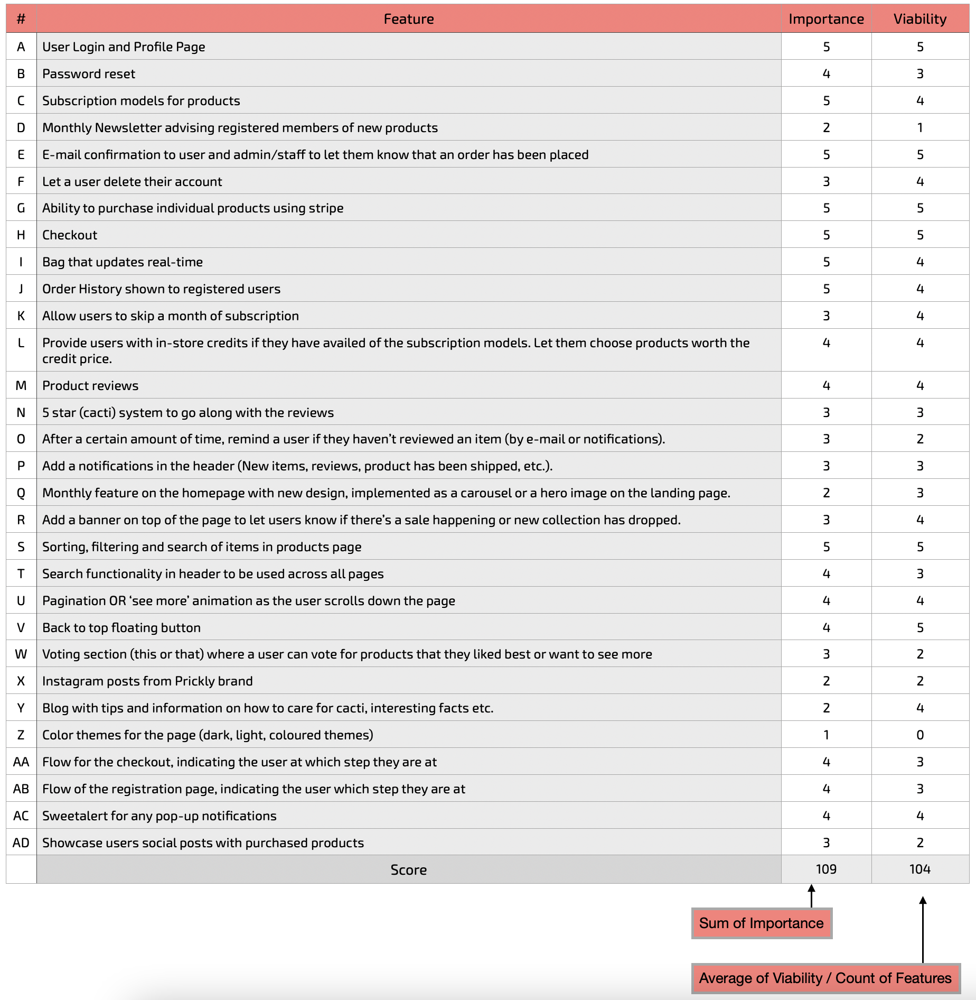
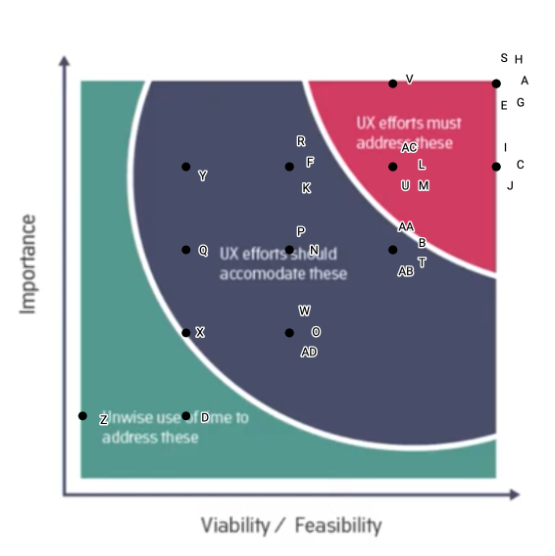

<h1 align="center">PRICKLY</h1>
<h1 align="center"></h1>

  :point_left: Live website

   :point_left: GitHub Repository
 
 # About

# Table of Contents

1. [User Experience (UX)](#user-experience)
    1. [Strategy Plane](#strategy-plane)
        1. [Business Goals](#business-goals)
        1. [User Stories](#user-stories)
    1. [Scope Plane](#scope-plane)
    1. [Structure Plane](#structure-plane)
    1. [Skeleton Plane](#skeleton-plane)
        - [Wireframes](#wirefr)

    1. [Surface Plane](#surface-plane)
        - [Color sheme](#color-scheme)
        - [Typography](#typography)
        - [Imagery](#imagery)
        - [Animations](#aniamations)
        - [Transitions](#transitions)

1. [Features](#features)
    1. [Existing Features](#existing-features)
        - [Common Features Accross Pages](#common-features-accross-pages)
        - [Features Specific to Pages](#features-specific-to-pages)
    1. [Future Features](#future-features)

1. [Information Architecture](#information-architecture)
    1. [Database](#database)
    1. [Structure](#structure)
    1. [Relationship](#relationship)

1. [Technologies Used](#technologies-used)
    1. [Languages](#languages)
    1. [Frameworks, Libraries and Programs](#frameworks,-libraries-and-programs)

1. [Testing](#testing)

1. [Deployment](#deployment)
    1. [Local](#local)
        - [Pre-requisites](#pre-requisites)
        - [Recommended](#recommended)
        - [Steps](#steps)
    1. [Remote](#remote)
        - [Pre-requisites](#pre-requisites)
        - [Steps](#steps)

1. [Credits](#credits)

# User Experience (UX)

## Strategy Plane
The main target audience for Prickly
- Age 15 - 35 as the product itself is filled with puns that might not be attractive to an older demographic.
- Users interested in cacti.
- Users interested in decorating their space.
- Users working with computers and interested in health benefits connected to cacti and computers.
- Users who don't feel discouraged by monthly subscription services.

The user can purchase individual items on the site which makes the site available to anyone visiting. However, due to the younger target audience, the main business model is subscription based to match up with multiple modern products. Each month users have the opportunity, based on their subscription value, to choosing new products that are delivered to them. This creates a fun aspect, inviting users to return and possibly purchase more products.

Research
- This is a B2C model, hence the website makes use of larger images/graphics and less text
- There are only a few cacti dedicated e-commerce sites, and none that I came across offering subscription services
- People purchasing items online are mostly impulse shopping and not many users like to register for new pages. This is why a subscription model is used to increase the number of returning users.

Features worth doing
- A Roadmap was used to identify which objectives are worth achieving. All objectives/high-level features were listed and scored on a 1-5 scale (5 being the most important) if they are Important or Viable. The importance score was summed together while the Viability scored was averaged and multiplied by the number of features. Since these numbers did not equal, they were plotted on the Importance/Viability graph to identify the most important ones and the ones that, for now, will be left out.

    

    

### Business Goals
- Earn profit by allowing anyone to purchase products
- Connect the business to users to access a larger audience by having social media links accessible 
- Outperform competitors by providing excellent products, services, and customer support
- Provide unique designs by collaborating each month with a different artist on accessory designs

### User Stories

- #### Common user stories
    1. xxx

- #### As a first time visitor
    1. xxx
    
- #### As a returning user
    1. xxx

- #### As an admin

## Scope Plane
- MVP - Minimal Viable Product, additionally, what features are planned for this website

## Structure Plane
- How the information is logically grouped together

## Skeleton Plane
- Higher and lower priorities in a site, how the user will navihate towards those

- ### Wireframes
    - 

        
Home Page

        
    

- ### Mockups
    - 

        
Home Page

        
    

## Surface Plane

- #### Color scheme
    - xxx

        
        

- #### Typography
    - xxx

        

- #### Imagery
    - Images
        - xxx

    - Graphics
        - xxx

- #### Other 
    - xxx

# Features

## Existing Features

### Common Features Across Pages
- [x] **Header** - facilitates an effortless navigation across all pages
    - xxx

### Features Specific to Pages
- [x] **Home** Page
    - xxx

## Future Features
- [ ] xxx

# Information Architecture

## Database
- xxx

## Structure
- xxx

## Relationship
- xxx

# Technologies Used

## Languages

## Frameworks, Libraries and Programs

# Testing

All testing was documented in [TESTING.md](https://github.com/LigaMoon/Prickly/blob/main/TESTING.md) file

<a href="https://github.com/LigaMoon/Prickly/blob/main/TESTING.md">   
:bar_chart: </a>  :point_left: testing.md

# Deployment

## Local

### Pre-requisites

### Recommended

### Steps

## Remote

### Pre-requisites

### Steps

# Credits

### Code :floppy_disk:
- Collapsible sections in README.md seen on [GitHub Gist](https://gist.github.com/pierrejoubert73/902cc94d79424356a8d20be2b382e1ab) post done by pierrejoubert73

### Media :clapper:
- xxx

### Acknowledgements
- xxx