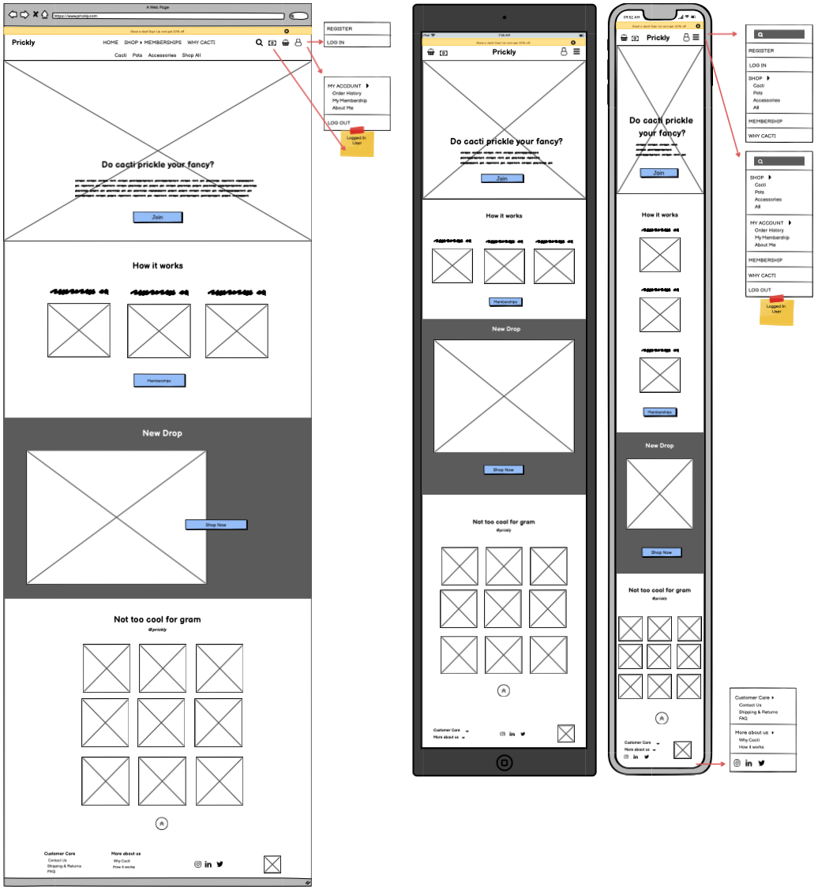

<h1 align="center">PRICKLY</h1>
<h1 align="center"></h1>

  :point_left: Live website

   :point_left: GitHub Repository
 
 # About

# Table of Contents

1. [User Experience (UX)](#user-experience)
    1. [Strategy Plane](#strategy-plane)
        1. [Business Goals](#business-goals)
        1. [User Stories](#user-stories)
    1. [Scope Plane](#scope-plane)
    1. [Structure Plane](#structure-plane)
    1. [Skeleton Plane](#skeleton-plane)
        - [Wireframes](#wireframes)

    1. [Surface Plane](#surface-plane)
        - [Color sheme](#color-scheme)
        - [Typography](#typography)
        - [Imagery](#imagery)
        - [Animations](#aniamations)
        - [Transitions](#transitions)

1. [Features](#features)
    1. [Existing Features](#existing-features)
        - [Common Features Accross Pages](#common-features-accross-pages)
        - [Features Specific to Pages](#features-specific-to-pages)
    1. [Future Features](#future-features)

1. [Information Architecture](#information-architecture)
    1. [Database](#database)
    1. [Structure](#structure)
    1. [Relationship](#relationship)

1. [Technologies Used](#technologies-used)
    1. [Languages](#languages)
    1. [Frameworks, Libraries and Programs](#frameworks,-libraries-and-programs)

1. [Testing](#testing)

1. [Deployment](#deployment)
    1. [Local](#local)
        - [Pre-requisites](#pre-requisites)
        - [Recommended](#recommended)
        - [Steps](#steps)
    1. [Remote](#remote)
        - [Pre-requisites](#pre-requisites)
        - [Steps](#steps)

1. [Credits](#credits)

# User Experience (UX)

## Strategy Plane
The main target audience for Prickly
- Age 15 - 35 as the product itself is filled with puns that might not be attractive to an older demographic.
- Users interested in cacti.
- Users interested in decorating their space.
- Users working with computers and interested in health benefits connected to cacti and computers.
- Users who don't feel discouraged by monthly subscription services.

The user can purchase individual items on the site which makes the site available to anyone visiting. However, due to the younger target audience, the main business model is subscription based to match up with multiple modern products. Each month users have the opportunity, based on their subscription value, to choosing new products that are delivered to them. This creates a fun aspect, inviting users to return and possibly purchase more products.

Research
- This is a B2C model, hence the website makes use of larger images/graphics and less text
- There are only a few cacti dedicated e-commerce sites, and none that I came across offering subscription services
- People purchasing items online are mostly impulse shopping and not many users like to register for new pages. This is why a subscription model is used to increase the number of returning users.

Features worth doing
- A Roadmap was used to identify which objectives are worth achieving. All objectives/high-level features were listed and scored on a 1-5 scale (5 being the most important) if they are Important or Viable. The importance score was summed together while the Viability scored was averaged and multiplied by the number of features. Since these numbers did not equal, they were plotted on the Importance/Viability graph to identify the most important ones and the ones that, for now, will be left out.

    

    

### Business Goals
- Earn profit by allowing anyone to purchase products
- Connect the business to users to access a larger audience by having social media links accessible 
- Outperform competitors by providing excellent products, services, and customer support
- Provide unique designs by collaborating each month with a different artist on accessory designs

### User Stories

- #### Common user stories
    1. xxx

- #### As a frequent site user I want to

- #### As a casual shopper I want to

- #### As a 

- #### As a first time visitor
    1. xxx
    
- #### As a returning user
    1. xxx

- #### As an admin

## Scope Plane
- MVP - Minimal Viable Product, additionally, what features are planned for this website

## Structure Plane
- How the information is logically grouped together

## Skeleton Plane
- Higher and lower priorities in a site, how the user will navihate towards those

- ### Wireframes
    - 

        
Home

        
    

    - 

        
Shop

        
    

    
    - 

        
Product

        
    

    - 

        
Memberships

        
    

    - 

        
Why Cacti

        
    

    - 

        
Shopping Bag

        
    

    - 

        
Checkout

        
    

    - 

        
Order History

        
    

    - 

        
Order Details

        
    

    - 

        
Register

        
    

    - 

        
Log In

        
    

    - 

        
My Details

        
    

    - 

        
Contact Us

        
    

    - 

        
Shipping and Returns

        
    

    - 

        
FAQ

        
    

## Surface Plane

- #### Color scheme
    - xxx

        
        

- #### Typography
    - xxx

        

- #### Imagery
    - Images
        - xxx

    - Graphics
        - xxx

- #### Other 
    - xxx

# Features

## Existing Features

### Common Features Across Pages
- [x] **Header** - facilitates an effortless navigation across all pages
    - xxx

### Features Specific to Pages
- [x] **Home** Page
    - xxx

## Future Features
- [ ] xxx

# Information Architecture

## Database
- xxx

## Structure
- xxx

## Relationship
- xxx

# Technologies Used

## Languages

## Frameworks, Libraries and Programs

# Testing

All testing was documented in [TESTING.md](https://github.com/LigaMoon/Prickly/blob/main/TESTING.md) file

<a href="https://github.com/LigaMoon/Prickly/blob/main/TESTING.md">   
:bar_chart: </a>  :point_left: testing.md

# Deployment

## Local
Instructions to run the project on your local device using an IDE

### Pre-requisites
- [Python 3](https://www.python.org/downloads/) - used to write the code and to run the project
- [PIP](https://pypi.org/project/pip/) - used to install packages
- [Git](https://git-scm.com/downloads) - used for version control
- [Visual Studio Code](https://code.visualstudio.com/) or any IDE of your choice - used to compile the code.
- [Stripe](https://stripe.com/en-ie) Account

### Recommended
- A virtual environment of your choice - used to contain all installations and packages and prevents clashing projects that might use the same package but different versions.
    - Python 3 has a built-in virtual environment [venv](https://docs.python.org/3/tutorial/venv.html). The commands might differ depending on your Operating System, it is advised to read the docs to ensure accuracy. To initialize on MacOS:

            python3 -m venv .venv
        where `.venv` is the name/path you are giving to the virtual environment

### Steps
1. Go to the project [repository](https://github.com/LigaMoon/Prickly)
1. Get the files used by using one of the methods below:
    1. Download the files used by clicking the 'Code' button located in the top section of the repository. Then select 'Download ZIP' and unzip the files in the directory of your choice.

     
    
    1. Clone the repository by running the following command from your IDE

            gh repo clone LigaMoon/Prickly
    
1. In your IDE, navigate to the project directory where you located downloaded files/cloned the repo

        cd path/to/your/folder
1. Activate your virtual environment. If using Python's venv:

        source .venv/bin/activate
    on MacOS and Unix where .venv is the name you gave previously

        .venv\Scripts\activate.bat
    on Windows where .venv is the name you gave previously

1. Install all reqauirements from [requirements.txt](requrements.txt) file
    
        pip3 install -r requirements.txt

1. Create a file `env.py` to store environment variables
1. Add environment variable in the format as shown below and also demonstrated in the [sample_env.py](sample_env.py) file

        os.environ.setdefault('SECRET_KEY', '<your-variable-goes-here>')
        os.environ.setdefault('DEVELOPMENT', '1')
        os.environ.setdefault('ALLOWED_HOSTS', '<your-variable-goes-here>')
        os.environ.setdefault('STRIPE_PUBLIC_KEY', '<your-variable-goes-here>')
        os.environ.setdefault('STRIPE_SECRET_KEY', '<your-variable-goes-here>')
        os.environ.setdefault('STRIPE_WH_SECRET', '<your-variable-goes-here>')
    where 
    -  `SECRET_KEY` value is a key of your choice, to ensure appropriate seccurity measures, this can be generated using [Django Secret Key Generator](https://miniwebtool.com/django-secret-key-generator/)
    -  `DEVELOPMENT` is set to `1` and is ised in settings.py logic to ensure file is dynamic between local and remote setups
    - `STRIPE_PUBLIC_KEY` and `STRIPE_SECRET_KEY` values are obatined from the [Stripe](https://stripe.com/en-ie) website
                

                        
How to get Stripe API values

                        <ul>
                            <li>Once logged in, you will be redirected to the **Overview** page, if not, navigate there by clicking **Overview** on the left hand side
                                
                            </li>
                            <li>Get the API values by clicking on **Get your test API keys** as shown in the image above</li>
                            <li>Add Publishable key as `STRIPE_PUBLIC_KEY` and Secret key as `STRIPE_SECRET_KEY` environmental variable values</li>
                        </ul>
                

    - `STRIPE_WH_SECRET` value is obtained from the [Stripe](https://stripe.com/en-ie) website in conjunction of using [ngrok](https://ngrok.com) to host the server
                    

                        
Getting Webhooks API value

                        <ul>
                            <li>Set up ngrok to generate a tunnel on your localhost port to use in Stripe webhooks later. Read on [ngrok](nhrok.com/downloads) website downloads page to learn how.</li>
                            <li>Go to your [stripe dashboard](dashboard.stripe.com) and naviagte to **Developers** > **Webhooks**
                                
                            </li>
                            <li>Click **Add endpoint** and enter your ngrok link followed by `/checkout/wh/` as shown in the image below</li>
                                
                            <li>Click on **recieve all events** and then Add endpoint to finish the setup</li>
                            <li>To get the `STRIPE_WH_SECRET` value, click on the added link under Endpoints and copy the Signing secret key in your variable</li>
                        </ul>
                

    - `ALLOWED_HOSTS` this should be set to your ngrok url
1. Run the application

        python3 manage.py runserver

1. Website should be available on a link similar to `http://127.0.0.1:8000`. (check your IDE terminal)
1. Note: `python3` and `pip3` commands can vary depending on version/machine/IDE you're using. Always check docs if unsure.

## Remote
### Pre-requisites
- Set up [Heroku](https://dashboard.heroku.com/apps) Account and app
        

            
Heroku Basic Set Up

            <ul>
                <li>Register to the Heroku website by clicking on this [sign up link(https://signup.heroku.com/login)]</li>
                <li>Create a new app on the Heroku website, enter a unique name and choose a region closest to you.
                    
                </li>
            </ul>
        

- Create AWS account and upload static files used in the project
        

            
AWS S3 static file storage setup

            <ul>
                <li>Go to [aws.amazon.com](https://aws.amazon.com/) website and Register, you might have to enter your credit card details, however, while using free tier there should be no charges. That being said, you should monitor your own usage.</li>
                <li>After registration, go back to the [AWS](https://aws.amazon.com/) site and click the orange 'sign in to the Console' button.</li>
                <li>Sign in as 'Root User' with your e-mail address and password used in registration.</li>
                <li>At the top of the site, search for S3 and click on it to open.</li>
                <li>Click on the **Create bucket** button located on the top right.
                    
                </li>
                <li>Name should match the Heroku app name, Region is set to the closest tot you, untick the 'Block all public access' and tick the acknowledgement next to the warning symbol.</li>
                <li>Go to the end and click **Create Bucket**</li>
                <li>To Enable static website hosting
                    <ul>
                        <li>Select the bucket by clicking on it and go to **Properties** located at the top.</li>
                        <li>Scroll down to the very bottom and click on 'Edit' under **Static website hosting**.</li>
                        <li>Select 'Enable' and enter the default values for Index document and Error document as these won't be used.
                                
                        </li>
                        <li>Click **Save changes**</li>
                    </ul>
                </li>
                <li>Make changes in Permissions
                    <ul>
                        <li>Go to **Permissions** located at the top</li>
                        <li>Scroll down and click 'Edit' under **Cross-origin resource sharing (CORS)** which will provide access between Heroku and the bucket</li>
                        <li>Scroll down to the very bottom and click on 'Edit' under **Static website hosting**.</li>
                        <li>Add the following JSON code (indent it properly) and save changes.
                            <pre>
                                [
                                    {
                                        "AllowedHeaders": [
                                            "Authorization"
                                        ],
                                        "AllowedMethods": [
                                            "GET"
                                        ],
                                        "AllowedOrigins": [
                                            "*"
                                        ],
                                        "ExposeHeaders": []
                                    }
                                ]
                            </pre>
                        </li>
                        <li>Click 'Edit' under **bucket policy** and click on 'Policy Generator' which will open in a new tab.</li>
                        <li>'Select Type or Policy' set to 'S3 Bucket Policy', 'Principal' set to '*', under 'Actions' add 'GetObject, GetObjectAcl, PutObject, PutObjectAcl, DeleteObject'</li>
                        <li>Go back to the previous tab and copy the **Bucket ARN** and paste it under **Amazon Resource Name (ARN)**
                             
                        </li>
                        <li>Click 'Add Statement' and then click 'Generate Policy'.</li>
                        <li>Copy the code, paste it in the **bucket policy** field (previous tab) and add `/*` after the ARN to allow all resources in the bucket</li>
                        <li>Click 'Save Changes'.</li>
                        <li>Still in permissions click 'Edit' under **Access control list (ACL)**</li>
                        <li>Under 'Everyone', tick 'List'</li>
                        <li>Tick 'I understand the effects....' and Save changes.</li>
                    </ul>
                </li>
                <li>At the top search for **IAM** and click on it.</li>
                <li> Create a Group
                    <ul>
                        <li>On the left hand side, under 'Access management' click on **Groups**
                            
                        </li>
                        <li>On the top right click 'Create New Group' and name it something that makes sense to you.</li>
                        <li>Click 'Next Step' and then 'Create Group' (skips the policy for now, we will create it in one of the following steps).</li>
                    </ul>
                </li>
                <li> Create a Policy
                    <ul>
                        <li>On the left hand side, under 'Access management' click on **Policies**.</li>
                        <li>On the top right click 'Create policy' select JSON and click on 'Import Managed Policy'.
                            
                        </li>
                        <li>Search for 'S3', select **AmazonS3FullAccess** and click 'Import'.</li>
                        <li>Since we only want full access to our Bucket, go back to copy your ARN from before and add it under 'Resource' twice, the second time with `/*` after the ARN.
                            
                        </li>
                        <li>Click on 'Review policy', add name and description and 'Create policy'.</li>
                    </ul>
                </li>
                <li> Attach the Policy to the Group created
                    <ul>
                        <li>Go to **Groups** on the left hand side.</li>
                        <li>Click on the relevant group and click on 'Attach Policy'.</li>
                        <li>Search for the policy just created, select it and click 'Attach Policy'.</li>
                    </ul>
                </li>
                <li> Create Users to put in the Group
                    <ul>
                        <li>Click on **Users** on the left hand side adn click 'Add user'.</li>
                        <li>Add name and tick to give 'Programmatic access', then click 'Next: Permissions'.</li>
                        <li>Select the group to put the user in and keep clicking 'Next; until the very end and click 'Create user'.</li>
                        <li>Click on 'Download .csv' file, this is important as you won't have access to it again!</li>
                        <li>Use the values from this file to later set your     `AWS_ACCESS_KEY_ID` and `AWS_SECRET_ACCESS_KEY` variables. </li>
                    </ul>
                </li>
        

### Steps
1. In Heroku, go to **Resources** and search for **Heroku Postgres**, we will use this as our development database
    - Select 'Hobby Dev - Free' and click to Submit Order Form

1. Comment out the 'SQLite and Postgres databases' section in the `settings.py` file and uncomment 'Postgres Database' section. Add your `DATABASE_URL` link obtained from Heroku Config Vars

        DATABASES = {
            'default': dj_database_url.parse('your-url-goes-here')
        }
1. Migrate your models to Postgres SQL database

        python3 manage.py migrate

1. If you have a JSON file with products displayed on the site, import them now in this order

        python3 manage.py loaddata categories
        python3 manage.py loaddata products

1. Create a superuser that will be used to access the admin page as well as to manage the database. Enter username, password, and e-mail as required

        python3 manage.py createsuperuser

1. In `settings.py` delete the 'Postgres SQL Database' section (make sure you don't commit your DATABASE_URL link!) and un-comment 'SQLite and Postgres SQL Databases' section - this will allow for use of  either of the databases interchangeably

1. Freeze dependencies in a  requirements.txt file (if it hasn't been created/updated before)

        pip3 freeze --local > requirements.txt

1. Create a Procfile that tells Heroku to create a web dyno and add the following line in it, where `the-name-of-your-app` is the name of your django project

        web: gunicorn the-name-of-your-app.wsgi:application

1. `Add`, `commit` and `push` your changes up to GitHub

1. Go to Heroku and add all of the following environmental variables (Settings > Reveal Config Vars)

    | Key | Value |
    --- | ---
    AWS_ACCESS_KEY_ID | `<your_aws_access__key>`
    AWS_SECRET_ACCESS_KEY | `<your_aws_secret_access_key>`
    DATABASE_URL | `generated automatically`
    EMAIL_HOST_PASS | `<your_email_key>`
    EMAIL_HOST_USER | `<your_email>`
    SECRET_KEY | `<your_secret_key>`
    STRIPE_PUBLIC_KEY | `<your_stripe_public_key>`
    STRIPE_SECRET_KEY | `<your_stripe_secret_key>`
    STRIPE_WH_SECRET | `<your_stripe_webhook_key>`
    USE_AWS | `True`
    ALLOWED_HOSTS | `<your-heroku-app-url>`
    
1. In Heroku go to **Deploy** that's located at the top of the site
        

1. Click on the **GitHub** option and connect your GitHub account as well as your repo from GitHub (search for the repo name)
        

1. Click on **Enable Automatic Deploys** and then **Deploy Branch**, you should see a successful build here
                    

1. Open your app
    

1. You should see `static/` folder with your static files in it in you S3 bucket.

1. In your S3 bucket, add `media/` folder.

1. If you didn't use JSON filer for product import, now is a good time to navigate to `your-ulr/admin/` page and add the Products and Categories in.

1. Your app should be deployed and you should be able to see your added products.

# Credits

### Code :floppy_disk:
- Collapsible sections in README.md seen on [GitHub Gist](https://gist.github.com/pierrejoubert73/902cc94d79424356a8d20be2b382e1ab) post done by pierrejoubert73

### Media :clapper:
- xxx

### Acknowledgements
- xxx
