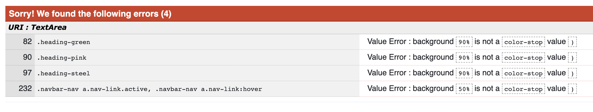

<h1 align="center">Prickly - Testing</h1>

  :point_left: Live website

 :point_left: GitHub Repository

<a href="https://github.com/LigaMoon/Prickly/blob/main/README.md"> :scroll: </a>  :point_left:  README.md file
 

# Table of Contents

1. [Functionality](#functionality)

1. [Validators](#validators)
    - [HTML5](#html5)
    - [CSS](#css)
    - [JavaScript](#javascript)
    - [Python](#python)

1. [Compatibility](#compatibility)

1. [Performance](#performance)

1. [User Stories](#user-stories)

1. [Bugs](#bugs)
    - [Identified Bugs](#identified-bugs)
    - [Existing Bugs](#existing-bugs)

1. [Future Testing](#future-testing)

# Functionality
- #### Navigation bar
    - The navigation bar is positioned at the top of the screen and stays visible on the top of the screen when the site is being scrolled.
    - When hovered over and/or active, the main nav links have a pink, offset background. The icons, when hovered over have filled in the background.
    - Home page and Membership links bring the user to the relevant pages.
    - Shop link when clicked, drops down a menu with item categories that bring the user to the shop page with the selected category displayed and items filtered.
    - Search button activates a dropdown with the search bar. This is fully active from all pages and returns items containing the searched word in the title or description.
    - Cart icon brings the user to the cart page.
    - When the user icon is clicked on, it opens up a dropdown menu displaying different options depending on whether the user is logged in or not. For logged-in users, 'Order History', 'My Membership', 'My Details', and 'Log Out' are displayed. Non authorized users to see 'Register'and 'Log In'.
    - When each link in the user dropdown is clicked, the user is navigated to the appropriate page.
    - On mobile and tablet views, the navbar collapses and a hamburger menu button is displayed instead.
    - When clicked, the hamburger menu reveals main menu items and the search bar that are all functional, when 'x' is clicked, the menu links are collapsed back in the navbar.
    - Hamburger menu icon is animated and works as expected.
    - The logo is a clickable link, when clicked on it brings the user to the home page.

- #### Footer
    - Footer is visible on all pages apart from membership checkout which is purposeful to prevent users from clicking out of the checkout.
    - Footer is always positioned at the bottom of the site, even when there isn't a full page of content, the footer stays at the bottom of the page.
    - When social links are clicked in the footer, a new tab opens and the relevant social page is displayed.
    - When hovered over, social buttons have filled in the background to help the user identify which link will be clicked on.

- #### Search bar
    - Search bar is collapsed/hidden by default to take up less space on the page.
    - When the search icon is clicked on desktop sizes, the search bar is revealed with seamless, smooth animation.
    - In mobile sizes, the search bar is incorporated in the collapsable menu and is shown when the hamburger menu button is clicked and the menu itself is revealed.
    - When the input is focused on, the form has a pink, sharp box-shadow to indicate that the user has clicked/tapped on it.
    - When an empty form is submitted, an error message is displayed to let the user know that a value is needed.
    - When a value is entered and 'Search' is clicked, the user is navigated to the 'Products' page (aka Shop) with matched results displayed.
    - If no results are found that match the search, a message is displayed on the screen to let the user know.

- #### Registration
    - When a user clicks on the 'Register' button from the main navbar or 'Sign Up' button in various alluth pages (such as 'Sign In'), the user is directed to the 'Memberships' page.
    - User can also navigate to the 'Memberships' page from the main navbar.
    - On the 'Memberships' page, the user has to select one of the membership types, one of them being free, after which the user is directed to the allauth 'Sign Up' form.
    - In the form, all fields are required, if any are left out, the allauth displays a validation message.
    - Allauth will also display a validation error if e-mails do not match, the username is shorter than 4 characters, passwords don't match, or if the password is not up to standards (too short, too similar to the username or e-mail, too easy/common).
    - When 'Sign Up' is clicked with a valid form, a message is displayed to let the user know that they have to validate their e-mail address.
    - User receives an e-mail from Prickly with a link that brings the user to the 'Confirm E-mail Address'. When 'confirm" is clicked on this page, the user is re-directed to the 'Sign In' page.
    - After a successful sign-in, the user is re-directed to the 'Membership Checkout' page where they have to confirm their selected membership or change it to a different one. If the user has chosen a paid membership plan, they will be navigated to a payment form.
    - When the user registers, their profile is created automatically.
    - From the 'Register' page, the user can access the 'Login' page using the link at the bottom which is functional.

- #### Sign Out / Log in
    - Sign in form allows users to sign in using their existing Prickly account or Google account.
    - For Prickly sign-in, the validation form will display a validation message if either password or username/e-mail are left blank.
    - Form will display a validation error if  username/e-mail and/or password were incorrect so malicious users don't know specifically which field was incorrect.
    - When the 'Forgot Password' link is clicked, the user is navigated to a page where they are prompted to enter their e-mail address. They will then receive an e-mail with a link to reset the password. When the link is clicked, the user is navigated to the page and prompted to enter the new password twice. If this is successful, the user is navigated to a success page.
    - When the 'Sign Up' link is clicked on the 'Login' page, the user is brought to the Register page.
    - When valid credentials are entered on the Log In page, the user is logged in and redirected to either the 'Membership Checkout' page if they just signed up, or their profile page if they didn't select a membership beforehand.
    - Log Out page has one button, which when clicked, removes the user's session and logs the user out. The user is then re-directed to the Home page.

- #### Home Page
    - Home page scrolls nicely and is responsive on all screen sizes.
    - All buttons are working and bring the user to the relevant page. Join and Memberships buttons bring the user to the 'Memberships' page where they can select the membership and register for the site.
    - Shop button brings the user to the shop so they can buy products.
    - Instagram account handle brings the user to the Instagram website (it's one of the future features to have an Instagram account and all pictures connected to it).

- #### Shop Page
    - When the Shop link in the navbar is clicked, a dropdown offers the user to select a category or view all items in the shop. Either option brings the user to the same Products page with items filtered to the selected category.
    - There are 4 category buttons on the top of the page that have a hover effect and also are styled differently when the category has been chosen.
    These work just like dropdown buttons in the navbar, however, the user doesn't have to go through the navbar.
    - When a category button is clicked, items are filtered to the selected category.
    - There is a filter/sort button just above the products, when this is clicked, it expands to reveal sorting buttons that sort selected items by added date, price, or alphabetically/reverse. If the filter button is clicked again, the sorting buttons disappear.
    - All of the sorting buttons have a hover effect to let the user easily identify which button will be clicked.
    - All products are laid out in a grid and a responsive design, resizing to have 4 items per row on extra-large screens, 3 on medium, 2 on small, and 1 on mobile view.
    - Each product have their Image, title, rating, price and 'Buy Now' button visible.
    - When the 'Buy Now' button is clicked, the item is automatically added to the cart.
    - When Item's image is clicked, the user is navigated to the individual item's page.

- #### Product Detail Page
    - Back button at the top of the page brings the user back to the previous page they were on.
    - Product Detail Page displays product image, title, description, quantity selector, price, 'put in the cart' button, and Reviews section at the bottom of the page.
    - When the user clicks +/- buttons for quantity, the quantity increases or decreases, and the price updates to reflect that.
    - the - button and + button are disabled (function and style) if the user has entered 1 or 10 to indicate that they cannot add more/less.
    - Typing has been disabled to prevent as much as possible for the user to 'accidentally' select more or less than the allowed quantity.
    - Arrow buttons are still available but allow the user to only enter 1-10 by using form validation.
    - If the user overrides the front-end validation (deleting HTML max and min attributes in Google Develop Tools for example) and enters a value that's >10 or <0, an error message is displayed and quantity not added.
    - When the user has selected a valid quantity and the 'Add to cart' button is clicked, an item is added to the cart and a cart notification is displayed with all items in the cart and the page is refreshed.
    - Reviews section shows all reviews (if any), the overall average product rating, and a Review button.
    - Review button is only displayed to logged-in users. This was tested by looking at pages while logged in and also when not.
    - When the Review button is clicked, a modal is opened as an overlay on the page with a review form. All fields are required and the form will not submit otherwise.
    - When 'x' or 'cancel' are clicked, the module is closed without saving.
    - When the form is filled out and the user clicks 'Add', the review is saved to the database, modal is closed and a success notification tells the user that the review was successfully added.
    - Overall rating is updated to include the new rating, and the review is displayed automatically.
    - User can only add 1 review per item
    - User can see 'edit' and 'delete' buttons under their reviews.
    - When the 'Edit' button is clicked, the modal opens with review's details prefilled. When 'x' and 'cancel' are clicked, the modal closes, and the review is not updated. If 'Edit' is clicked, the review is updated, modal closed, and a message is displayed to let the user know.
    - If the 'delete' button is clicked, a modal appears asking the user to confirm if they want to delete the review. If 'x' or cancel are clicked, the modal is closed and the review is not deleted. If 'delete' is clicked, the review is deleted and a message is displayed confirming it to the user.

- #### Memberships Page
    - This page should be displayed slightly differently depending on if the user is logged in or not.
    - For a non-authorized user it displays all three memberships with benefits, images, titles, price, and 'Prick Me' buttons.
    - Authorized user sees the same, however, the membership that they have subscribed to has a border around it and the 'Prick Me' button says 'Subscribed' and is disabled. Other buttons now say 'Change'.
    - If a user is authorized but they skipped the subscription or it's their first time signing in (just after registration), they will be re-directed to this page after each sign-in and a message will display that the user does not have a membership plan yet and they will be allowed to select a membership using 'Prick Me' buttons.
    - When a user without a membership subscription selects a membership using the 'Prick Me' button, they are re-directed to the Membership Checkout page.
    - User will see their selected membership with benefits and can change the membership by selecting a different one under the 'Change' dropdown and clicking 'Update. When the user clicks 'Update' the page will refresh and selected members will be updated.
    - Under 'Payment' user sees the total and a message stating that the amount will be taken out monthly.
    - When 'Confirm' is clicked, the user is navigated to a checkout form hosted by Stripe with payment details to be added.
    - Each field in this form is mandatory and validation is handled by Stripe.
    - If a valid form is entered, by using a webhook user's details are added to the Stripe system, added in the database as StripeCustomer, and new membership is added to the user's profile.
    - User is then re-directed to their profile page which displays the membership summary and amount.
    - If the webhook fails and the user's details are not added to the systems, the user will be re-directed to the membership page next time they sign in.
    - When a user with existing membership clicks on the 'Change' button, they are redirected to the Membership Change page which uses the same template as Memebrership Checkout, however, they see their current as well as selected membership details displayed for comparison. Additionally, they cannot update their selected membership and they can cancel the change if they changed their mind.
    - When Cancel is clicked on, the user is re-directed to the products page.
    - When Confirm is clicked, the user's membership is updated and they are re-directed to their profile where they can see their new membership summary, and a message is displayed to confirm the change.
    - Membership checkout and membership change pages do not display header and footer to prevent the user from clicking out without completing the subscription and not having a membership attached to their profile. This is handled in the back end but will be more of annoyance as the next time when user logs in they will be re-directed to the Memberships page. Users changing their membership can cancel it as they already have a membership associated with their account.

- #### Shopping Cart Page and toast
    - When the user clicks 'Buy Now' or 'Add to the cart' from the products detail view, the item is added to the cart and cart toast is displayed and a little badge with item count is added to the cart icon in the navbar.
    - In cart toast, the user sees item image, price, quantity, and total.
    - If the user changes the quantity in the cart toast, the page refreshes, and the cart, as well as cart toast, are updated.
    - When 'Don't want this' is clicked, the page is refreshed and the item is removed from the cart and new cart toast is shown. If this was the last item, a message is displayed letting the user know that the cart is empty.
    - From cart toast, if the user clicks on 'View Cart', they are navigated to the Shopping Cart page.
    - From the cart toast, when 'Checkout' is clicked, the user is navigated to the checkout page.
    - When 'x' is clicked in the cart toast, the toast is closed, otherwise, it stays open for 90000 ms but not forever.
    - User can navigate to the cart page from the navbar, cart toast, or checkout page.
    - On the page, the user sees a summary of their order, with items, their price, image, quantity, and total displayed. They also see the subtotal and a note that this amount excludes the delivery charges. The user does see a discount, if any, that is applied.
    - When 'More Shopping' is clicked, the user is navigated to the shop page.
    - When 'Checkout' is clicked, the user is navigated to the checkout page to proceed with the payment.
    - when +/- buttons are clicked, quantity is updated and the page refreshed, this logic is the same as on the product detail page however loops through all the items and each is functioning as expected.
    - When 'I don't want this' is clicked, the item is removed from the cart.
    - If the last item is removed, the user will see an 'empty cart' text and a button redirecting them to the shop page.

- #### Checkout Page
    - On the checkout page, the user sees Delivery, Shipping, and Payment Info forms and order summary.
    - Only the Delivery form is active, making the user select the payment method.
    - When the delivery method is selected and 'Apply' is clicked, Delivery Info becomes disabled displaying selected value, the delivery charge is updated and the rest of the form becomes available.
    - Apply button now says 'Change', when clicked, the form is cleared and the user can change the delivery type.
    - If a user tries to 'Apply' delivery type without selecting a value, the form validation will return a validation message.
    - Discount and delivery are calculated based on the membership, if any, and whether this is the user's first order ever.
    - All fields are required apart from the 'Region/State', if they are not filled out, validation will prompt the user to fill it in.
    - If a user submits the form with an invalid phone number, and an error message will let them know that the form and phone number are invalid.
    - If the user enters invalid card details, Stripe will return an error with an error message displayed.
    - When a valid form has been filled out, and the user clicks on 'Make Payment' they see a loading page and then are re-directed to the Checkout Success page where they can see their order details, with a customer, and shipment details added.
    - When the user clicks on the 'Back to the Shop' button, they are re-directed to the shop page.
    - If the user decides to add more products before the payment button is clicked but after the delivery type is selected, the delivery type will remain selected for when the user returns to the checkout page and they only have to enter their delivery and payment information.
    - If the user is logged in, they are offered an option to save their shipping details to their profile.
    - If the user is not logged in, they can log in or sign up using the links under the Delivery Form

- #### Profile Page
    - When user signs in, they are re-directed to the Profile page, user can also access it via the 'My details' link in the user dropdown in the navbar.
    - User sees the Membership summary at the top with the name and the monthly price. 
    - When a user clicks on 'More' under membership summary, they are navigated to the user membership page where they can see more details.
    - In the profile user also sees their profile details that user can edit/add and click save to amend them in the database.
    - If the user adds an item to the cart and goes to checkout now, they will see their saved details prefilled in the form after selecting the delivery type.

- #### User Memebrship Page
    - Logged in user only can navigate to this page from the navbar by clicking on the 'My Membership' link or their profile page.
    - User sees their selected membership details and benefits and the 'Change' button at the bottom.
    - When the change button is clicked, the user is redirected to the Membership page which displays all memberships for a user with a membership already active. This page was tested and described under the 'Membership Page' section.

- #### Order History
    - Logged in user only can navigate to this site by clicking on the 'Order History' link in the navbar.
    - User will see all of their orders in a collapsed accordion with the latest order on top revealed.
    - In a collapsed view, the user can see order number, total, and order date.
    - When a user clicks on an order, it expands to reveal items ordered and an 'Order Details' button.
    - Each item has its image, name, total, and quantity displayed, and 'Review' and 'Buy again' buttons are displayed under the item.
    - When the 'Review' button is clicked, the user is navigated to the item's detail page, review section where they can add an order.
    - When the 'Buy Again' button is clicked, the user is redirected to the item's detail page, top section, where they can purchase the item again.
    - When a user clicks on another order, the previous one collapses and the next one expands.
    - Expanded order summary top details will change background and text color to signify to the user which order is expanded.
    - When the 'Order Details' button is clicked, the user is navigated to the Order Details page where they can see the detailed view of the order which uses the same template as the checkout success page.
    - User sees the Order date on top, as well as delivery and dispatch dates. If the order has not been dispatched or delivered yet, they will see estimated dispatch or/and estimated delivery dates.
    - There is a back button at the top of the page under the header, this button takes the user back to the Order History page.

# Validators

## [HTML5](https://validator.w3.org/)
- :white_check_mark: Home - [Pass](https://validator.w3.org/nu/?showsource=yes&doc=https%3A%2F%2Fprickly-app.herokuapp.com%2F)
- :white_check_mark: Shop - [Pass](https://validator.w3.org/nu/?showsource=yes&doc=https%3A%2F%2Fprickly-app.herokuapp.com%2Fproducts%2F#l644c105)
    - 1 warning advising for me to remove type attribute from script tag. This is a script tag inserted by AWS and cannot be removed.
- :white_check_mark: Product Details - [Pass](https://validator.w3.org/nu/?showsource=yes&doc=https%3A%2F%2Fprickly-app.herokuapp.com%2Fproducts%2F5)
- :white_check_mark: Memberships - [Pass](https://validator.w3.org/nu/?showsource=yes&doc=https%3A%2F%2Fprickly-app.herokuapp.com%2Fmemberships%2F)
- :white_check_mark: Membership Checkout - [Pass](https://validator.w3.org/nu/?showsource=yes&doc=https%3A%2F%2Fprickly-app.herokuapp.com%2Fmemberships%2Fmembership_checkout%2F)
- :white_check_mark: Memebrship Change - [Pass](https://validator.w3.org/nu/?showsource=yes&doc=https%3A%2F%2Fprickly-app.herokuapp.com%2Fmemberships%2Fmembership_change%2F)
- :white_check_mark: Cart - [Pass](https://validator.w3.org/nu/?showsource=yes&doc=https%3A%2F%2Fprickly-app.herokuapp.com%2Fcart%2F)
- :white_check_mark: Delivery - [Pass](https://validator.w3.org/nu/?showsource=yes&doc=https%3A%2F%2Fprickly-app.herokuapp.com%2Fcheckout%2Fdelivery%2F#l1124c74)
- :white_check_mark: Checkout - [Pass](https://validator.w3.org/nu/?showsource=yes&doc=https%3A%2F%2Fprickly-app.herokuapp.com%2Fcheckout%2F)
- :white_check_mark: Checkout Success - [Pass](https://validator.w3.org/nu/?showsource=yes&doc=https%3A%2F%2Fprickly-app.herokuapp.com%2Fcheckout%2F5C7B1A32-6CB6-4B95-AA16-EBB09BA8C23E%2Fcheckout_success%2F)
- :white_check_mark: Profile - [Pass](https://validator.w3.org/nu/?showsource=yes&doc=https%3A%2F%2Fprickly-app.herokuapp.com%2Fprofile%2F)
- :white_check_mark: User Membership Detail - [Pass](https://validator.w3.org/nu/?showsource=yes&doc=https%3A%2F%2Fprickly-app.herokuapp.com%2Fmemberships%2Fuser_membership%2F)
- :white_check_mark: Order History - [Pass](https://validator.w3.org/nu/?showsource=yes&doc=https%3A%2F%2Fprickly-app.herokuapp.com%2Fprofile%2Forders%2F)
- :white_check_mark: Order Details - [Pass](https://validator.w3.org/nu/?showsource=yes&doc=https%3A%2F%2Fprickly-app.herokuapp.com%2Fprofile%2Forders%2F9)
- :white_check_mark: Log In - [Pass](https://validator.w3.org/nu/?showsource=yes&doc=https%3A%2F%2Fprickly-app.herokuapp.com%2Faccounts%2Flogin%2F)
- :white_check_mark: Register - [Pass](https://validator.w3.org/nu/?showsource=yes&doc=https%3A%2F%2Fprickly-app.herokuapp.com%2Faccounts%2Fsignup%2F)

## [CSS3](https://jigsaw.w3.org/css-validator/)
- :white_check_mark:base.css - Pass
- :white_check_mark:home.css - Pass
- :white_check_mark:checkout.css - Pass
- :white_check_mark:membership_checkout.css - Pass
- :white_check_mark:shop.css - Pass
- :white_check_mark:orders.css - Pass
- **Note** - When validating [base.css](https://github.com/LigaMoon/Prickly/blob/main/static/css/base.css) and [home.css](https://github.com/LigaMoon/Prickly/blob/main/home/static/home/css/home.css), validator returned errors associated with not recognizing variables in linear gradient. If variables were overwritten by regular color names, the validator passes. This has also been echoed in this [Stack Overflow Post](https://stackoverflow.com/questions/57661659/w3c-css-validation-parse-error-on-variables) Additionally validator displays warnings as it does not recognizes imports adn prefixes. 

    
    

## [JSHint](https://jshint.com/)
- :white_check_mark:base.js - Pass
- :white_check_mark:stripe.js - Pass
- :white_check_mark:stripe_sub.js - Pass
- :white_check_mark:product_item.js - Pass
- :white_check_mark:shop.js - Pass
- :white_check_mark:cart.js - Pass
- **Note** - All files passed, only feedback was regarding ES6 (let, const, =>, string literals etc), and use of built in variables such as `Stripe` and `$`.
Examples of these are shown in the images below.

    
    

## [PEP8](http://pep8online.com/)
- :white_check_mark:all - Pass
- I used [flake8](https://flake8.pycqa.org/en/latest/) installed on my VSCode IDE as a validator throughout the project.
- Additionally I also added all python files written by me in the [PEP8](http://pep8online.com/) validator online to ensure all files fit the standard.
- **Note** - Few files that came built in Django did not meet PEP8 requirements (such as [settings.py](https://github.com/LigaMoon/Prickly/blob/main/prickly/settings.py)). However these were not written by myself and the formatting was left as is.

# Usability
- xxx

# Compatibility
- Browser Compatibility

    | Screen size\Browser | Safari           | Opera            | Microsoft Edge   | Chrome           | Firefox          | Internet Explorer |
    | --------------------|:----------------:|:----------------:|:----------------:|:----------------:|:----------------:|:-----------------:|
    | Mobile              |:heavy_check_mark:|:heavy_check_mark:|:heavy_check_mark:|:heavy_check_mark:|:heavy_check_mark:| Not Tested        |
    | Tablet              |:heavy_check_mark:|:heavy_check_mark:|:heavy_check_mark:|:heavy_check_mark:|:heavy_check_mark:| Not Tested        |
    | Laptop              |:heavy_check_mark:|:heavy_check_mark:|:heavy_check_mark:|:heavy_check_mark:|:heavy_check_mark:| Not Tested        |
    | Desktop             |:heavy_check_mark:|:heavy_check_mark:|:heavy_check_mark:|:heavy_check_mark:|:heavy_check_mark:| Not Tested        |

- xxx

# Performance Testing
- xxx.
    - Home Page - [Results](xxx)
    - Items Page - [Results](xxx)
    - Register Page - [Results](xxx)
    - Log In Page - [Results](xxx)
    - My Profile
    - Add Item

        

# User Stories

# Bugs
 :beetle:
1. ## Identified bugs
    - xx
2. ## Existing Bugs
    - xx

# Future Testing
- xx